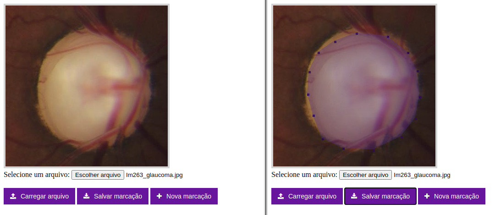
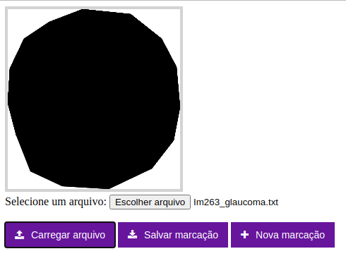

---

<h1 align="center">
  CanvasMarking
</h1>

  
  
  

---

## :smiley: Sobre o repositório

Neste respositório, disponibilizo um algoritmo para marcação de imagens utilizando o Canvas do HTML 5, desenvolvido como trabalho prático da disciplina de Computação Gráfica. A ideia desse algoritmo é simular um sistema de marcações de lesões em exames médicos, a fim de gerar as máscaras dessas marcações para posteriores aplicações, como, por exemplo, a extração de características em um sistema de Visão Computacional. As screenshots abaixo mostram uma imagem carregada no código e as marcações feitas nela:

  

Após salvar as marcações, as coordenadas serão armazenadas em um arquivo .txt. Abrindo este arquivo, podemos visualizar a máscara da imagem, como mostra a screenshot abaixo. Um requisito do trabalho era exibir a máscara dentro da bounding box da lesão, ou seja, o tamanho da imagem resultante dessa marcação não poderia ultrapassar as maiores coordenadas encontradas no arquivo .txt.

  

---

## :rocket: Tecnologias utilizadas

Foram utilizadas as seguintes tecnologias no desenvolvimento do projeto:

- HTML 5
- JavaScript
- CSS 3
- HTML Canvas

---

## :computer: Execução da aplicação

Inicialmente, clone este repositório executando:

    git clone https://github.com/VitoriaCarvalho/CanvasMarking.git
    
A execução da aplicação é bem simples, basta abrir o arquivo `index.html` pelo seu navegador :)

---

## :pencil: Ideias de implementações futuras no algoritmo

A aplicação está bem simples, pelo fato de ser apenas um trabalho prático de uma disciplina. Mas a ideia em si é super legal e dá para fazer bastante coisa com o canvas. Meu intuito em publicar esse repositório foi ajudar iniciantes do canvas, pois tive dificuldades em encontrar o que eu precisava na documentação.

Seria legal que o algoritmo contemplasse as seguintes features:

- Permitir o salvamento das máscaras;
- Implementar as marcações não apenas na bounding box da(s) lesão(ões), mas no tamanho original da imagem;
- Centralizar a imagem na tela e capturar os movimentos do mouse por lá;
- Renderizar a imagem na tela assim que ela tiver sido escolhida no seletor de imagens.

---

## :muscle: Como contribuir

- Faça um fork desse repositório;
- Crie uma branch com a sua feature: `git checkout -b minha-feature`;
- Faça commit das suas alterações: `git commit -m 'feat: Minha nova feature'`;
- Faça push para a sua branch: `git push origin minha-feature`.

---

## :memo: Licença

Esse projeto está sob a licença MIT. Veja o arquivo [LICENSE](https://github.com/VitoriaCarvalho/CanvasMarking/blob/master/LICENSE) para mais detalhes.

---

Desenvolvido por <a href="https://www.linkedin.com/in/vit%C3%B3ria-carvalho-90210b19a/">Vitória Carvalho :woman::computer:</a>

---
